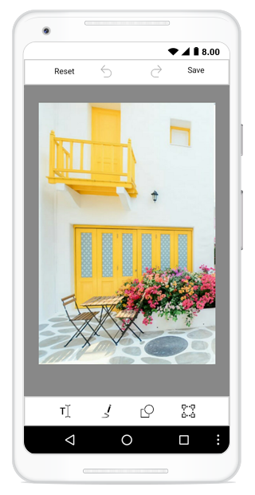

# Getting started sample of SfImageEditor in Xamarin.Android

This section explains you the steps required to load an image to the image editor. Image editor has a built in toolbar which has options to edit the image with shapes, path, text, crop and flip.

## Reference Essential Studio components in your solution
After installing Essential Studio for Xamarin, you can find all the required assemblies in the installation folders,

{Syncfusion Installed location}\Essential Studio\15.2.0.40\lib

**NOTE**

Assemblies are available in unzipped package location in Mac.

Add the following assembly references to the Android project,

`android\Syncfusion.SfImageEditor.Android.dll`

**IMPORTANT**

Starting with v16.2.0.x, if you reference Syncfusion assemblies from trial setup or from the NuGet feed, you also have to include a license key in your projects. Please refer to this link to know about registering Syncfusion license key in your Xamarin application to use our components.

## Initialize the image editor

The following steps explain on how to create a image editor and configure its elements,

Create an instance of SfImageEditor.
```
SfImageEditor editor  = new SfImageEditor(this);
    SetContentView(editor);
    
    ```
    
Load an image to the image editor as bitmap object.Since SfImageEditor supports bitmap images you can load the image to the control as a bitmap object only.
```
SfImageEditor editor = new SfImageEditor();
    editor.Bitmap = BitmapFactory.DecodeResource(Resources, Resource.Drawable.screenshot);
```  
Loading the image to the SfImageEditor, you can start to edit the image by using the built-in Toolbars.


